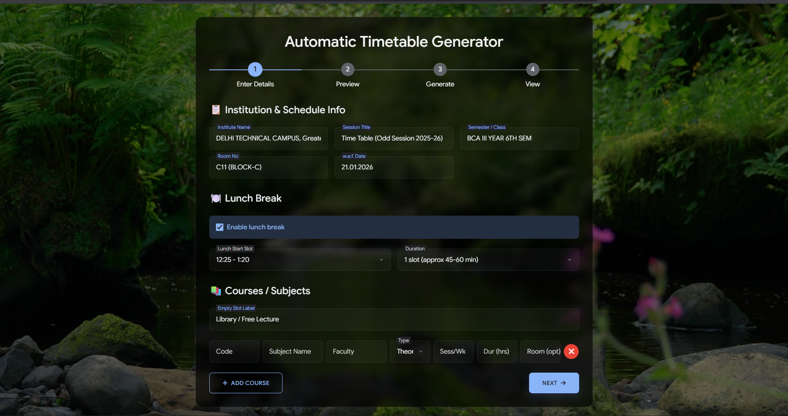
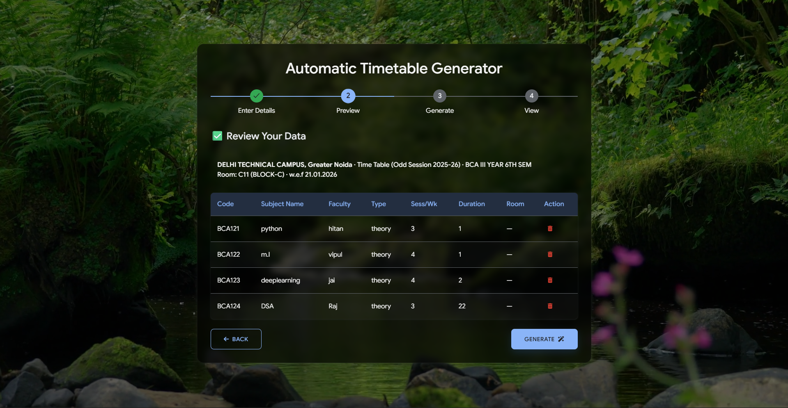
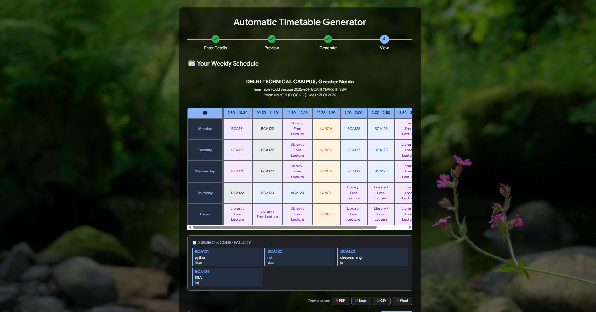

# 🏛️ InstiTime - Institute Timetable, Simplified

An intelligent web-based timetable generator that transforms complex academic scheduling into a seamless, automated workflow. Perfect for colleges, universities, and schools.


## 🌟 Features

### Core Functionality
- **Intelligent Scheduling Algorithm**: Automatically places courses across the week using a greedy placement strategy
- **Multi-step Wizard**: Guided workflow for entering data, previewing, and generating timetables
- **Flexible Course Management**: Support for both theory and lab courses with custom room assignments
- **Configurable Lunch Break**: Adjustable timing and duration (1-2 slots)
- **Empty Slot Management**: Customizable filler for free periods (e.g., "Library", "Self Study")

### Export Options
- 📄 **PDF** - Professional, print-ready format with table styling
- 📊 **Excel** - Editable spreadsheet format for further manipulation
- 📋 **CSV** - Universal format for data analysis
- 📝 **Word** - Document format for reports and sharing
- 🖨️ **Print** - Direct printing with optimized layout

### User Interface
- **Glass-morphism Design**: Modern, translucent interface with background video
- **Dark/Light Theme**: Automatic adaptation to system preferences
- **3D Interactive Elements**: Hover effects, button tilts, and smooth animations
- **Responsive Layout**: Works seamlessly on desktop, tablet, and mobile devices
- **Progress Tracking**: Visual stepper to guide users through the process

### Technical Highlights
- **Real-time Validation**: Immediate feedback on missing or duplicate data
- **Local Storage**: Persists course data for recovery
- **Color-coded Courses**: Visual distinction for different subjects
- **Faculty Legend**: Clear mapping of courses to instructors

## 🚀 Screeshot of This small project
-- Front page

-- preview

-- Generator


## 📋 Prerequisites

- Modern web browser (Chrome, Firefox, Safari, Edge)
- Internet connection for CDN resources (fonts, libraries)
- Background video file (optional) placed at `css/bg.mp4`

## 🛠️ Installation

1. **Clone the repository**
   ```bash
   git clone https://github.com/yourusername/automatic-timetable-generator.git
   cd automatic-timetable-generator

## File Structure

automatic-timetable-generator/
├── index.html
├── timetable.html
├── css/
│   └── style.css
│   └── bg.mp4 (optional)
├── js/
│   ├── app.js
│   ├── form.js
│   ├── timetable.js
│   └── ui.js
└── assets/
    └── favicon.ico (optional)